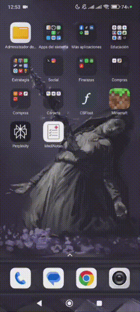

 <h1 style="text-align:center;">Aplicacion con N8N</h1>

## Descripción del proyecto

Aplicación Android para gestionar notas médicas (guardado en Google Drive opcional). Implementada en Java/Kotlin con arquitectura sencilla; incluye autenticación con Google (clase `GoogleAuthManager`) y pantallas como `WelcomeActivity` y `MainActivity`. Pensada para uso local y sincronización con Drive si el usuario lo autoriza.

## Instrucciones de instalación

1. Clonar el repositorio:
2. Abrir el proyecto en Android Studio (recomendado: Android Studio Narwhal 4 Feature Drop | 2025.1.4).

3. Si usas Windows, ejecutar el wrapper de Gradle desde la terminal del proyecto o usar la interfaz de Android Studio:
4. Conectar un dispositivo o arrancar un emulador y ejecutar desde Android Studio: Run > app.

5. (Opcional) Configurar credenciales de Google:
   - Añadir el archivo `google-services.json` a `app/` si usas Firebase/Google APIs.
   - Configurar SHA-1 en la consola de Google Cloud para autenticación
6. (Opcional) Instalar el APK agregado al repositorio.

## Requisitos

- Android Studio (versión recomendada: 2025.1.4 Narwhal).
- JDK 11 o superior.
- Android SDK (API level mínimo según `build.gradle`; recomendable SDK 31+).
- Conexión a Internet para dependencias y APIs externas.
- (Opcional) Cuenta de Google y acceso a Google Cloud / Drive API para sincronización.

## Dependencias principales 

```groovy
// add inside dependencies { ... }
implementation 'androidx.appcompat:appcompat:1.6.1'
implementation 'com.google.android.material:material:1.9.0'
implementation 'androidx.constraintlayout:constraintlayout:2.1.4'

// Google Sign-In
implementation 'com.google.android.gms:play-services-auth:20.7.0' g

// Opcional: Google Drive / APIs (si usas sincronización)
implementation 'com.google.api-client:google-api-client-android:1.34.1'
implementation 'com.google.apis:google-api-services-drive:v3-rev20230308-2.0.0'
```

## Demostrativos

### Inicio de Sesion con google
Se agrego un inicio de sesion con google para poder acceder a los datos de google del usuario.



